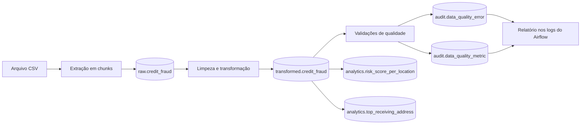

# Pipeline de análise de fraude em transações

Pipeline de dados desenvolvido para o desafio técnico. A solução
ingere um arquivo CSV de transações, normaliza e tipa os dados, executa
validações de qualidade e publica dois resultados analíticos em PostgreSQL.
Todo o fluxo é orquestrado pelo Apache Airflow e executado em containers Docker.

## Objetivos

O projeto entrega os seguintes resultados:

1. média de `risk_score` por `location_region`;
2. os três `receiving_address` com maior `amount`, considerando somente a
   transação mais recente de tipo `sale` de cada endereço;
3. métricas de qualidade por execução e por resultado analítico;
4. registro detalhado das anomalias encontradas, com rastreabilidade até a
   linha do arquivo de origem.

## Arquitetura



A solução utiliza dois bancos PostgreSQL independentes:

- `postgres`: banco interno do Airflow, usado para metadados da orquestração;
- `postgres-dw`: data warehouse da solução, exposto na porta `5433` da máquina
  local e dividido nos schemas `raw`, `transformed`, `analytics` e `audit`.

### Fluxo da DAG

A DAG `dag_credit_fraud` executa as tarefas nesta ordem:

```text
start
  -> test_db_connection
  -> extract_data
  -> transform_data
  -> [load_risk_score_per_location, load_top_receiving_address]
  -> report_data_quality
  -> end
```

As duas tabelas analíticas são processadas em paralelo. A geração do relatório
de qualidade só começa quando ambas terminam.

Atualmente a DAG está configurada para execução manual. 

## Tecnologias

| Tecnologia | Uso no projeto |
| --- | --- |
| Python | Implementação da extração, transformação e validação |
| Pandas | Leitura em chunks, tipagem, limpeza e validação dos dados |
| Apache Airflow 3.3.1 | Orquestração, dependências, execução e logs |
| PostgreSQL 16 | Persistência das camadas e resultados analíticos |
| SQLAlchemy | Acesso transacional ao PostgreSQL |
| Docker e Docker Compose | Ambiente reproduzível para Airflow e bancos |

As versões das dependências Python estão fixadas em `requirements.txt`.

## Estrutura do projeto

```text
.
├── dags/
│   └── dag_credit_fraud.py          # Definição e dependências da DAG
├── data/
│   └── raw/
│       └── df_fraud_credit.csv      # Arquivo de entrada (não versionado)
├── data_exploration/                # Notebooks de exploração do dataset
├── sql/
│   └── ddl.sql                      # Schemas, tabelas e índices do DW
├── src/
│   ├── etl/
│   │   ├── CSVExtractor.py          # Leitura incremental do CSV
│   │   ├── DatabaseHandler.py       # Operações de banco de dados
│   │   ├── data_quality.py          # Regras de Data Quality
│   │   └── transform.py             # Tipagem e normalização
│   └── pipeline/
│       └── CreditFraudPipeline.py   # Coordenação das etapas do pipeline
├── Dockerfile                       # Imagem customizada do Airflow
├── docker-compose.yaml              # Serviços da aplicação
└── requirements.txt                 # Dependências Python
```

## Modelo de dados

O DDL completo pode ser consultado em `sql/ddl.sql`.

### Camada `raw`

#### `raw.credit_fraud`

Armazena os dados como foram recebidos, preservando campos como texto quando
eles ainda precisam ser validados. Também contém metadados de rastreabilidade:

| Grupo | Principais colunas |
| --- | --- |
| Origem | `source_pipeline`, `source_file_name`, `source_row_number` |
| Execução | `execution_id`, `execution_timestamp`, `ingestion_timestamp` |
| Integridade | `source_hash` |
| Negócio | timestamp, endereços, valor, tipo, região, score e demais atributos |

O `source_row_number` identifica a linha original do CSV e o `source_hash`
representa o conteúdo bruto das colunas de negócio.

### Camada `transformed`

#### `transformed.credit_fraud`

Contém os registros normalizados e com tipos adequados para análise:

- `transaction_timestamp`: `TIMESTAMP`;
- `amount`: `NUMERIC(18, 2)`;
- `risk_score`: `DOUBLE PRECISION`;
- campos categóricos e identificadores: `VARCHAR`;
- `record_hash`: chave primária calculada após a limpeza;
- `source_hash` e `source_row_number`: ligação com a origem;
- `transformed_at`: momento da transformação.

A carga usa `UPSERT` por `record_hash`. Quando o mesmo registro transformado é
processado novamente, seus metadados são atualizados em vez de criar uma nova
cópia na camada transformada.

### Camada `analytics`

#### `analytics.risk_score_per_location`

| Coluna | Descrição |
| --- | --- |
| `location_region` | Região válida |
| `avg_risk_score` | Média do score de risco da região |
| `total_records` | Registros considerados no agregado |
| `updated_at` | Momento da atualização |

Somente regiões do domínio esperado e scores entre 0 e 100 participam do
resultado.

#### `analytics.top_receiving_address`

| Coluna | Descrição |
| --- | --- |
| `receiving_address` | Endereço recebedor |
| `amount` | Valor da transação mais recente do endereço |
| `transaction_timestamp` | Data e hora dessa transação |
| `updated_at` | Momento da atualização |

Primeiro são filtradas as transações de tipo `sale`. Em seguida,
`ROW_NUMBER()` identifica a transação mais recente de cada endereço. Por fim,
os registros são ordenados por `amount` e limitados aos três maiores.

### Camada `audit`

#### `audit.data_quality_error`

Mantém uma linha por violação encontrada. Registra execução, hash, linha de
origem, tabela de origem e destino, coluna, tipo e mensagem do erro.

#### `audit.data_quality_metric`

Mantém o resumo da qualidade para cada combinação de execução e tabela-alvo:

| Métrica | Definição |
| --- | --- |
| `total_records` | Quantidade de registros avaliados |
| `valid_records` | Registros sem violações |
| `invalid_records` | Registros com uma ou mais violações |
| `total_violations` | Total de regras violadas; pode superar o número de linhas inválidas |
| `conformity_percentage` | `valid_records / total_records * 100` |

## Limpeza e transformação

As principais operações aplicadas são:

- conversão de `timestamp` Unix para data e hora;
- conversão de `amount`, `login_frequency`, `session_duration` e `risk_score`
  para tipos numéricos, usando nulo quando a conversão não é possível;
- remoção de espaços nas extremidades;
- normalização de espaços repetidos;
- conversão de categorias para letras minúsculas;
- tratamento de valores como `null`, `none`, `nan`, `n/a`, `undefined` e
  `missing` como nulos;
- preservação dos identificadores sem convertê-los para minúsculas;
- geração dos hashes de origem e do registro transformado.

## Data Quality

As validações são executadas antes da publicação de cada resultado.

### Média de risco por região

- `location_region` não pode ser nulo;
- a região deve pertencer a `africa`, `asia`, `europe`, `north america`,
  `south america` ou `oceania`;
- `risk_score` não pode ser nulo;
- `risk_score` deve estar entre 0 e 100.

### Top endereços recebedores

- `receiving_address` não pode ser nulo;
- `transaction_type` não pode ser nulo;
- `amount` não pode ser nulo;
- `transaction_timestamp` não pode ser nulo.

Antes de gravar os resultados de uma nova tentativa da mesma execução, os
erros e as métricas anteriores daquela tabela-alvo são removidos. Isso evita
duplicar a auditoria ao repetir uma task.

O resumo das métricas e das anomalias é publicado nos logs da task
`report_data_quality`.

## Como executar

### Pré-requisitos

- Docker Engine;
- Docker Compose v2;
- arquivo `df_fraud_credit.csv` em `data/raw/`.

### 1. Configurar o ambiente

Crie um arquivo `.env` na raiz. Exemplo:

```dotenv
AIRFLOW_UID=1000
FERNET_KEY=<chave-fernet>
_AIRFLOW_WWW_USER_USERNAME=airflow
_AIRFLOW_WWW_USER_PASSWORD=airflow
```

No Linux, o UID pode ser obtido com:

```bash
id -u
```

Uma chave Fernet pode ser gerada com:

```bash
python -c "from cryptography.fernet import Fernet; print(Fernet.generate_key().decode())"
```

### 2. Construir as imagens e iniciar os bancos

```bash
docker compose build
docker compose up -d postgres postgres-dw
```

### 3. Criar as estruturas do data warehouse

Em um volume novo, execute o DDL uma vez:

```bash
docker compose exec -T postgres-dw \
  psql -U dw_user -d finance < sql/ddl.sql
```

O DDL não deve ser reaplicado integralmente sobre um banco já inicializado,
pois algumas tabelas não usam `CREATE TABLE IF NOT EXISTS`.

### 4. Inicializar e iniciar o Airflow

```bash
docker compose up airflow-init
docker compose up -d
```

A interface estará disponível em <http://localhost:8080>.

### 5. Configurar a conexão do Airflow

Na interface do Airflow, crie uma conexão em **Admin > Connections**:

| Campo | Valor |
| --- | --- |
| Connection ID | `postgres_dw` |
| Connection Type | `Postgres` |
| Host | `postgres-dw` |
| Database | `finance` |
| Login | `dw_user` |
| Password | `dw_password` |
| Port | `5432` |

Dentro da rede Docker deve ser usado `postgres-dw:5432`. A porta `5433` é
destinada ao acesso a partir da máquina local.

### 6. Executar a pipeline

Na interface do Airflow:

1. localize `dag_credit_fraud`;
2. habilite a DAG, que nasce pausada por configuração;
3. selecione **Trigger DAG**;
4. acompanhe as tasks e seus logs pela visão da DAG.

## Consultando os resultados

### Média de risco em ordem decrescente

```sql
SELECT
    location_region,
    avg_risk_score,
    total_records,
    updated_at
FROM analytics.risk_score_per_location
ORDER BY avg_risk_score DESC;
```

A ordenação deve ser informada na consulta, pois tabelas relacionais não
possuem ordem intrínseca.

### Top 3 endereços

```sql
SELECT
    receiving_address,
    amount,
    transaction_timestamp
FROM analytics.top_receiving_address
ORDER BY amount DESC;
```

### Métricas da última execução

```sql
SELECT *
FROM audit.data_quality_metric
ORDER BY created_at DESC, target_table;
```

### Anomalias encontradas

```sql
SELECT
    execution_id,
    target_table,
    source_row_number,
    column_name,
    error_type,
    error_message,
    created_at
FROM audit.data_quality_error
ORDER BY created_at DESC, source_row_number;
```

## Estratégia de processamento

- O CSV é lido em chunks de 100 mil registros para controlar o consumo de
  memória.
- A consulta da camada bruta é processada em chunks de 50 mil registros.
- Inserções em lote reduzem o número de viagens ao banco.
- A camada `raw` mantém o histórico por execução.
- A camada `transformed` aplica deduplicação lógica por `record_hash`.
- As tabelas analíticas são reconstruídas a cada execução com `TRUNCATE` e
  `INSERT`, representando o estado analítico atual.
- `max_active_runs=1` impede duas execuções simultâneas da DAG e evita disputa
  durante a reconstrução das tabelas analíticas.

## Observabilidade e tratamento de falhas

O Airflow registra início, volume processado e conclusão de cada etapa. Falhas
de conexão, transformação, validação ou persistência interrompem a task e ficam
disponíveis nos logs. As tasks podem ser repetidas individualmente pela
interface.

Os identificadores `execution_id`, `source_hash` e `source_row_number` permitem
relacionar uma anomalia à execução e ao registro que a originou.
